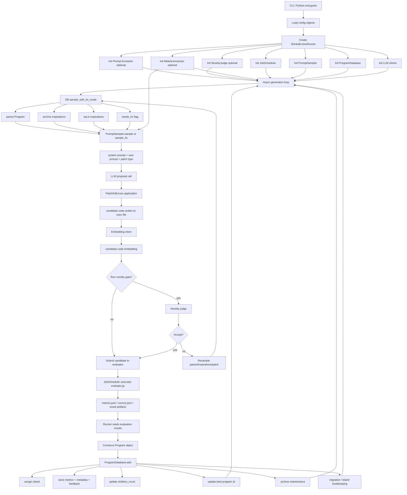
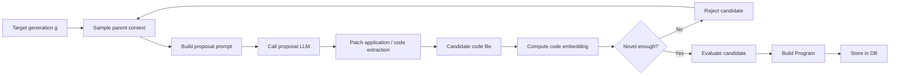
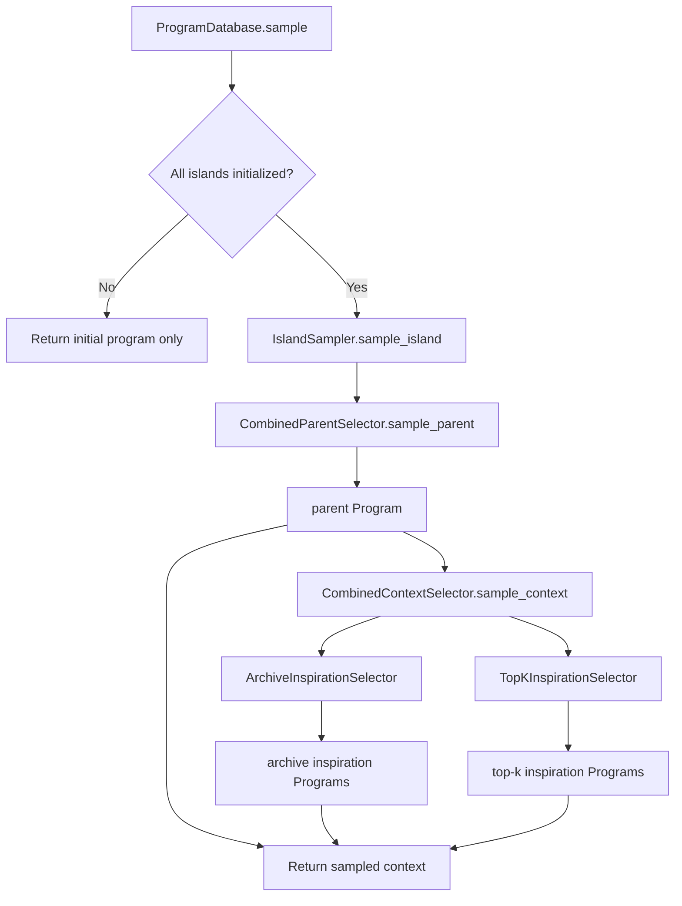
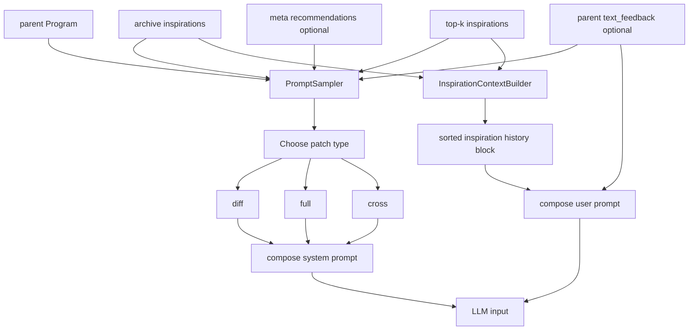
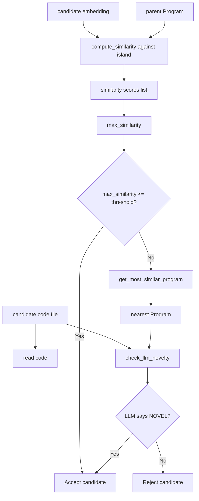
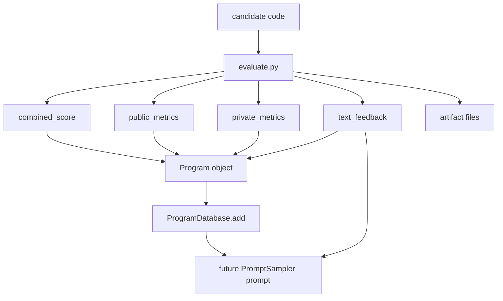
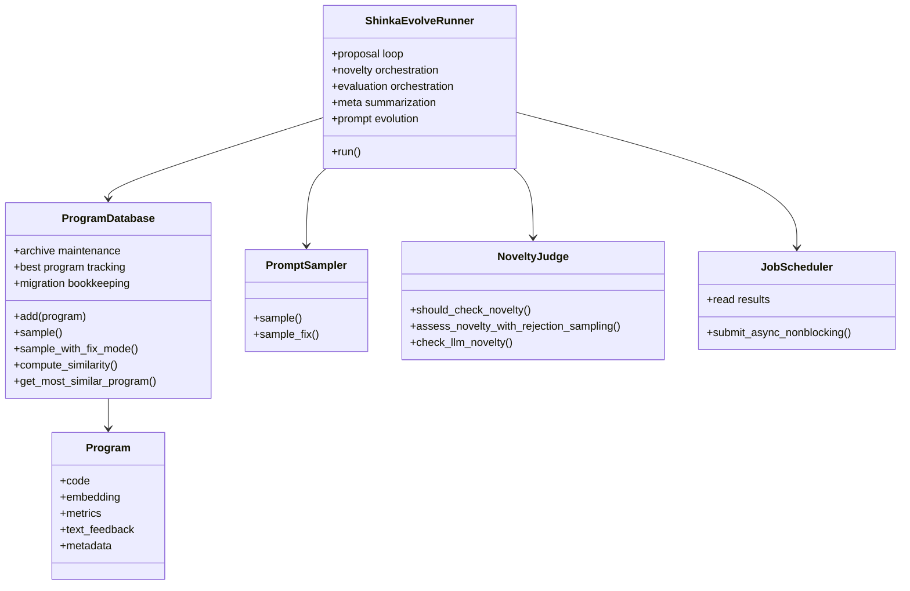
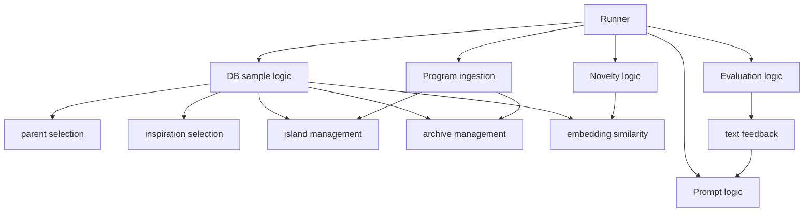
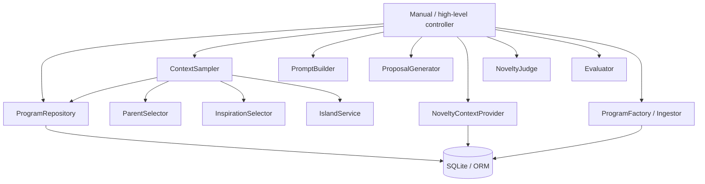

# Shinka Data Flow

This document shows the current end-to-end data flow in Shinka as it exists
today. It is intentionally descriptive, not aspirational.

The diagrams below reflect the current architecture:

- runner-centric orchestration
- SQLite-backed `ProgramDatabase`
- prompt sampling + patch generation
- optional novelty gating
- evaluation
- re-ingestion into the database

## 1. Full Run Flow

## 2. Proposal Loop in More Detail

## 3. What `ProgramDatabase.sample(...)` Is Actually Doing

## 4. Prompt Assembly Flow

## 5. Novelty Path

Important current behavior:

- similarity is computed against all embedded programs in the parent's island
- only the single nearest neighbor is passed to the novelty LLM
- the novelty metadata is mostly stored for observation, not reused later for
  algorithmic control

## 6. Evaluation Feedback Loop

This is the main evaluator-to-proposer feedback path:

- evaluator writes `text_feedback`
- runner stores it on `Program`
- `PromptSampler` injects parent `text_feedback` into future prompts if
  `use_text_feedback=true`

## 7. Current Data Ownership

## 8. Where the Coupling Is

This is the main reason the system feels spaghetti-like:

- `ProgramDatabase` is both persistence and search policy
- `Runner` is both orchestrator and lifecycle owner of almost everything
- novelty and retry behavior are split between judge and runner
- prompt policy and scheduling are not clearly separated

## 9. Rough Target Refactor

This is the cleaner shape to move toward:

That would separate:

- persistence
- search policy
- proposal generation
- novelty decision
- orchestration

instead of forcing all of them through `ShinkaEvolveRunner` and
`ProgramDatabase`.
