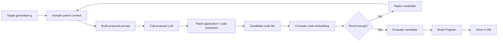

# Refactor Backbone: Minimal Proposal Pipeline

This is the first intentional cut for cleaning up Shinka's architecture.

We are explicitly treating this flow as the backbone:

Everything optional is deliberately out of scope for the first pass:

- meta summarization
- prompt evolution
- dynamic islands
- migration tuning
- novelty LLM variants
- fix mode
- async throughput tuning

## Refactor Principle

Each box in the flow should eventually map to a small public interface.

Target interfaces:

- `ContextSampler`
- `PromptBuilder`
- `ProposalGenerator`
- `CandidateFactory`
- `EmbeddingService`
- `NoveltyGate`
- `Evaluator`
- `ProgramFactory`
- `ProgramRepository`

The current code does not align with this. The current runner and database own
too many of these responsibilities at once.

## First Step

We start with `ProgramRepository`.

Why first:

- the current `ProgramDatabase` mixes persistence with search policy
- everything else depends on `Program` retrieval / storage
- creating a repository boundary lets later services depend on persistence
  without inheriting sampling, novelty, or archive logic

## What `ProgramRepository` Should Own

Persistence only:

- add program
- get program by id
- get best program
- list programs
- list top programs
- list by generation
- get ancestry
- get lightweight summaries
- get total count / freshness info
- close storage

## What `ProgramRepository` Should Not Own

Not in scope:

- parent selection
- inspiration selection
- island sampling
- novelty checking
- prompt building
- archive strategy
- migration policy

Those should move to separate services later.

## Migration Strategy

Step 1:

- add a thin `ProgramRepository` wrapper over `ProgramDatabase`
- no behavior change
- no ORM yet

Step 2:

- update new code paths to depend on `ProgramRepository`, not `ProgramDatabase`
- introduce `SampledContext` and `ContextSampler` as the typed boundary for
  "sample parent context"

Step 3:

- split parent selection / inspiration selection / fix-mode detection out of the
  current DB-backed `ContextSampler`

Step 4:

- split novelty into:
  - `NoveltyPolicy`
  - `NoveltyContextProvider`
  - `NoveltyJudge`

Step 5:

- only after boundaries are clean, consider replacing SQLite row plumbing with
  an ORM-backed repository implementation

## Important Constraint

An ORM is not the first win by itself.

If we put an ORM underneath the current responsibilities, we still have the
same spaghetti with prettier persistence code.

The first win is:

- clean interfaces
- explicit object boundaries
- fewer hidden side effects

Then persistence technology can be swapped later.
